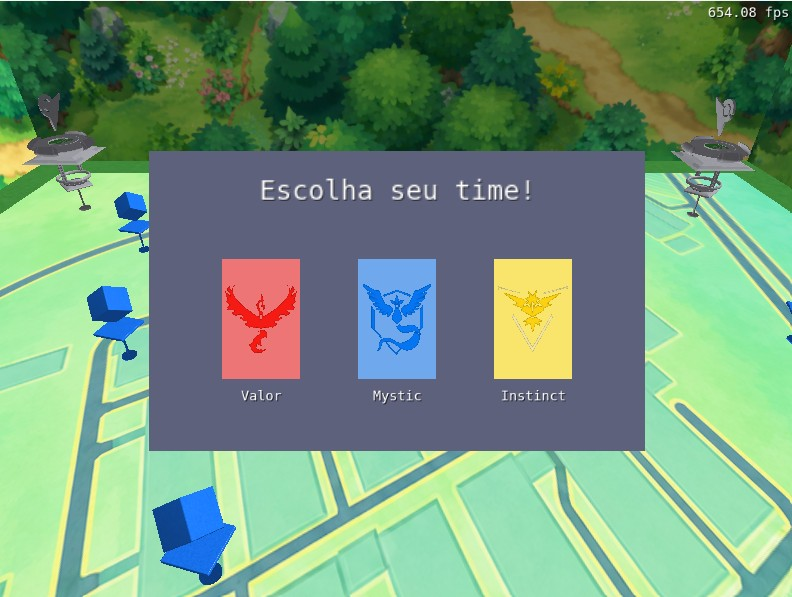
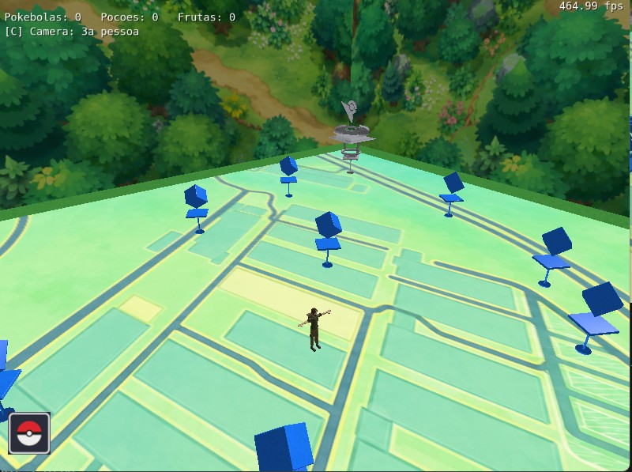
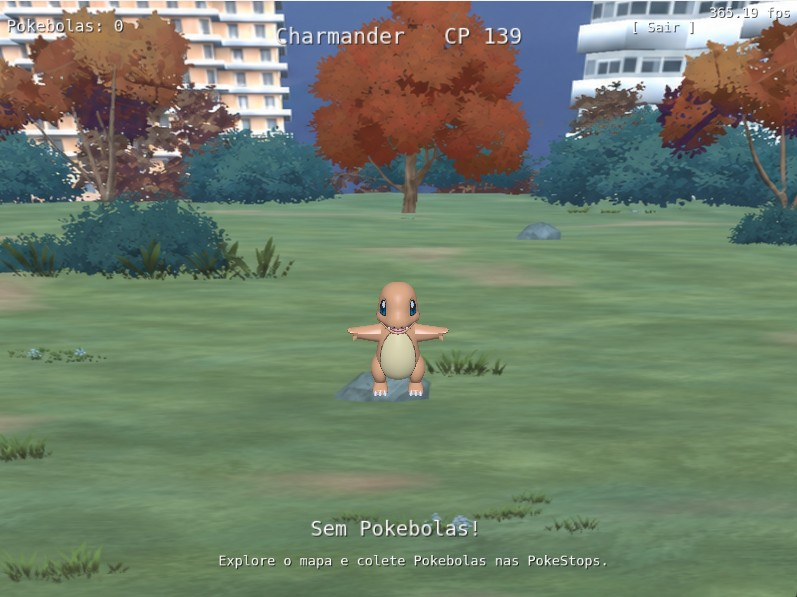
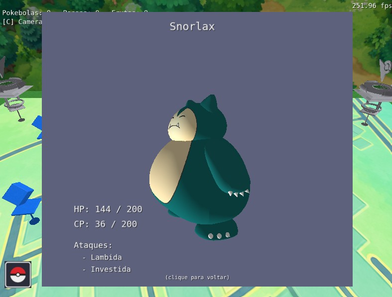
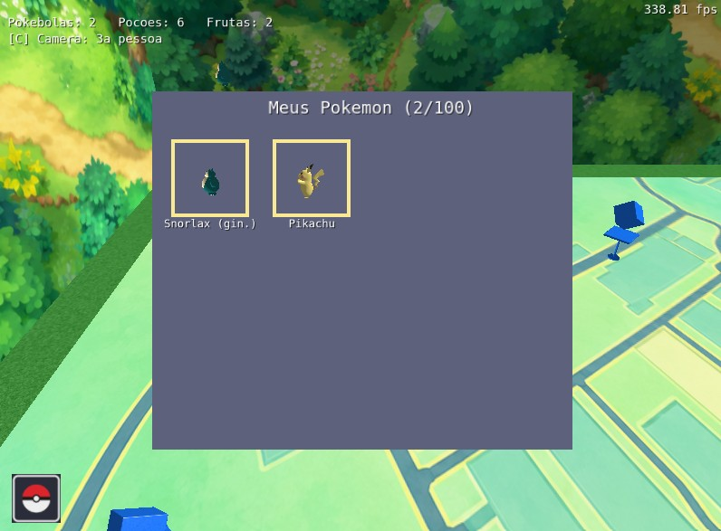

# Computação Gráfica e Visualização I (INF01047) - INF/UFRGS

# Aplicação Desenvolvida

  Foi desenvolvida uma aplicação baseada no jogo Pokémon GO. O objetivo da aplicação é navegar pelo mapa e capturar Pokémon. Implementamos um sistema de captura, visualização dos Pokémon capturados, obtenção de pokebolas através de pokestops espalhadas pelo mapa e ginásios onde o jogador pode deixar um de seus Pokémon como defensor. Também há um sistema de evolução em que, reunindo a quantidade de doces obtidos na captura necessária, um Pokémon pode ser evoluído para sua próxima forma. 

# Contribuição

Camila: Mapa, pokéstops e ginásios, captura, armazenamento dos Pokémon, câmeras e modelos de iluminação, animações e texturas.

Gilmar: Sistema de colisão, modelos 3D dos Pokémon e menu inicial.

# Uso de IA

Para a realização deste trabalho foram utilizadas duas IAs generativas. A primeira, usada de maneira pontual, foi o ChatGPT - GPT-5.5, que foi utilizado para gerar imagens de florestas e do mapa do bloco IV do Campus do Vale com estética semelhante ao jogo original.

Para o desenvolvimento da aplicação, foi utilizado de maneira substancial o Claude Code, modelo OPUS 4.8. Ele foi utilizado principalmente para relacionar os elementos e interações visuais com a mecânica do jogo, por exemplo, as animações de jogar uma fruta para um Pokémon no ginásio envolvem ações de lógica do jogo que precisam se converter em ações visuais. Além disso, foi utilizado para conhecer sintaxe e comandos tanto do C++ quanto de OpenGL, reduzindo a curva de aprendizado e o tempo necessário para usar estes artefatos. 

A IA foi de grande ajuda, mas é preciso sempre lembrar de suas limitações e sua maneira de funcionar. Além disso, em um uso extensivo, é fácil perder o controle sobre o que está sendo feito. Em várias etapas foi preciso parar e analisar criteriosamente o que o Claude estava propondo. Em um dado momento, em que estava com dificuldades na animação das pokéstops, solicitei ao Claude que fizesse o modelo da pokéstop mais simples. Então ele transformou a pokéstop em um monolito. De fato, estava mais simples, mas não era o que eu precisava. Então, ao longo do trabalho, notei que precisava dar contexto, orientações claras e técnicas para a aplicação.

# Ilustração

# Manual da Aplicação

  Ao iniciar o jogo, o jogador deverá escolher a sua equipe, clicando com o botão esquerdo do mouse. Durante a exploração do mapa, o jogador pode se mover no WASD ou nas setas do teclado e pode alternar para câmera livre ao pressionar a tecla 'C'. No modo câmera livre, o jogador pode descer a câmera ao pressionar a tecla 'Q' e subir a câmera na tecla 'E'. Em ambos os modos de visualização, é possível rotacionar a câmera ao pressionar e manter o botão esquerdo do mouse.

  Ao se aproximar de um Pokémon, pokestop, ginásio ou o balão da Rocket, é possível interagir com estes objetos ao clicar neles com o botão esquerdo do mouse. Ao clicar em um Pokémon, o jogador iniciará o modo captura. No modo de captura, é possível pressionar a tecla 'ESC' para sair ou clicar no botão "sair" no canto superior direito da tela. Para capturar um Pokémon, é necessário que o jogador já tenha obtido pokebolas nas pokestops. Para realizar a captura, o jogador deve pressionar e manter a tecla 'L' e soltá-la para arremessar a pokebola no Pokémon. 
  Os controles completos do jogo estão em [CONTROLES.md](CONTROLES.md).

# Compilação

A compilação da aplicação permanece inalterada em relação à estrutura inicial disponibilizada no template do repositório, conforme o arquivo [COMPILACAO.md](COMPILACAO.md).

Nota: A palavra Pokémon não tem plural, por isso, mesmo quando nos referimos a mais de um Pokémon, a escrita se mantém inalterada.