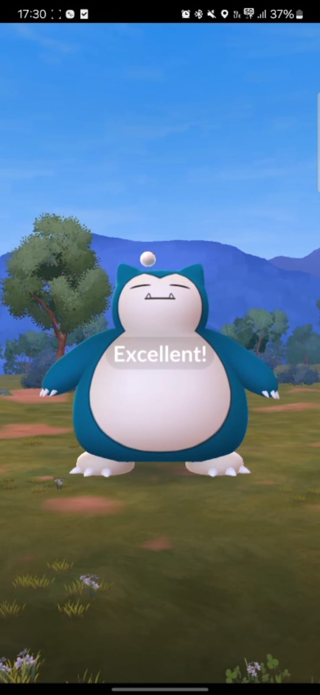
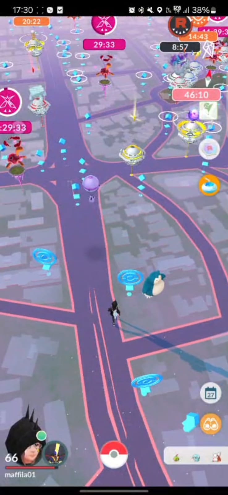
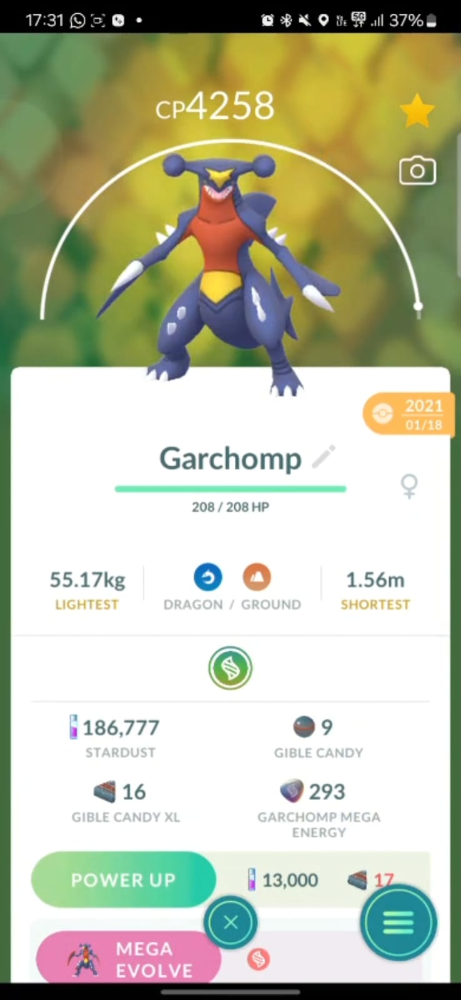

# Especificação da Implementação

> [!CAUTION]
> - Você <ins>**não pode utilizar ferramentas de IA para escrever esta
>   especificação**</ins>

## Integrantes da dupla

- **Aluno 1 - Nome**: Camila Maffi
- **Aluno 1 - Cartão UFRGS**: 00243691

- **Aluno 2 - Nome**: <mark>`<preencher>`</mark>
- **Aluno 2 - Cartão UFRGS**: <mark>`<preencher>`</mark>

## Detalhes do que será implementado

- **Título do trabalho**: Pokémon Go simplificado
- **Parágrafo curto descrevendo o que será implementado**: 
Será implementada uma versão simplificada de Pokémon GO, com um mapa fechado inspirado no terreno do Bloco IV do Campus do Vale. O usuário controlará a movimentação do personagem pelo teclado, explorando o ambiente, interagindo com PokéStops e ginásios, e encontrando Pokémon em pontos específicos do mapa.

## Especificação visual

### Vídeo - Link

> [!IMPORTANT]
> - Coloque aqui um link para um vídeo que mostre a aplicação gráfica
>   de referência que você vai implementar. **Sua implementação deverá
>   ser o mais parecido possível com o que é mostrado no vídeo (mais
>   detalhes abaixo).**
> - **Você não pode escolher como referência: (1) algum trabalho realizado
>   por outros alunos desta disciplina, em semestres anteriores. (2) Minecraft.**
> - Por exemplo, você pode colocar um vídeo de um jogo que você gosta,
>   e seu trabalho final será uma re-implementação do jogo.
> - O vídeo pode ser um link para YouTube, Google Drive, ou arquivo mp4 dentro
>   do próprio repositório. Mas, garanta que qualquer um tenha
>   permissão de acesso ao vídeo através deste link.

[Demo Pokémon Go](demo-spec/demo-pokemon-go.mp4) 

### Vídeo - Timestamp

> [!IMPORTANT]
> - Coloque aqui um **intervalo de ~30 segundos** do vídeo acima, que
>   será a base de comparação para avaliar se o seu trabalho final
>   conseguiu ou não reproduzir a referência.

- **Timestamp inicial**: 00:00:06
- **Timestamp final**: 00:00:38

### Imagens

> [!IMPORTANT]
> - Coloque aqui **três imagens** capturadas do vídeo acima, que você
>   irá usar como ilustração para as explicações que vêm abaixo.

## Especificação textual

Para cada um dos requisitos abaixo (detalhados no [Enunciado do Trabalho final - Moodle](https://moodle.ufrgs.br/mod/assign/view.php?id=6018620)), escreva um parágrafo **curto** explicando como este requisito será atendido, apontando itens específicos do vídeo/imagens que você incluiu acima que atendem estes requisitos.

### Malhas poligonais complexas
Serão utilizadas malhas poligonais para representar o personagem, os Pokémon e elementos do cenário, como chão, ruas, silhuetas de prédios no mapa, PokéStops e ginásios. Os Pokémon visíveis no mapa terão malhas poligonais mais simples, para reduzir a complexidade da cena, enquanto os Pokémon exibidos em momentos de captura e visualização terão malhas mais detalhadas, com mais elementos de forma, para se aproximarem melhor da aparência do jogo.

### Transformações geométricas controladas pelo usuário
O usuário poderá controlar a movimentação do personagem pelo mapa usando o teclado. Serão aplicadas transformações de translação e rotação para deslocar o personagem pelas ruas e alterar sua direção conforme os comandos. Também haverá transformação de escala e rotação em alguns objetos, como PokéStops, Pokémon e a Pokébola durante a cena de captura.

### Diferentes tipos de câmeras
A aplicação terá uma câmera em terceira pessoa, que acompanha o personagem durante a exploração do mapa, e uma câmera mais próxima para destacar a cena de encontro ou captura do Pokémon. Além disso, terá uma câmera livre, controlada pelo usuário, para visualizar o cenário de outros ângulos.

### Instâncias de objetos
Serão usadas várias instâncias de objetos repetidos no cenário, como PokéStops, Pokémon e ginásios. Esses objetos reutilizarão a mesma malha base, mas com diferentes posições, rotações e escalas, como acontece no mapa do vídeo.

### Testes de intersecção
Serão implementados testes de intersecção simples para detectar a proximidade entre o personagem e objetos interativos, como PokéStops, ginásios e Pokémon. Quando o personagem estiver próximo de um Pokémon, será possível iniciar a cena de captura. Nessa cena, também será verificada a intersecção entre a Pokébola e o Pokémon para determinar se a tentativa de captura acertou o alvo.

### Modelos de Iluminação em todos os objetos
Será usada uma fonte de luz principal simulando a luz do ambiente externo, com componentes ambiente, difusa e especular, para destacar o volume dos objetos e elementos do cenário. Na cena de captura, haverá variação de iluminação para simular a funcionalidade do jogo, em que a iluminação muda de acordo com o período do dia.

### Mapeamento de texturas em todos os objetos
Serão aplicadas texturas nos objetos da cena, como grama no chão, asfalto nas ruas, cores e detalhes nas PokéStops, e textura colorida nos Pokémon. As texturas serão simplificadas no mapa, mas terão o objetivo de aproximar visualmente a cena da referência do vídeo. Nas cenas de captura e visualização, as texturas dos Pokémon serão mais detalhadas, para melhorar sua aparência.

### Movimentação com curva Bézier cúbica
A curva Bézier cúbica será usada para animar a trajetória da Pokébola durante a captura. A Pokébola partirá da posição do jogador e seguirá uma curva até o Pokémon, simulando o arremesso mostrado na cena de encontro. Além disso, curvas Bézier também serão usadas para movimentar os balões da Equipe Rocket, que circularão pelo céu do mapa seguindo trajetórias curvas.

### Animações baseadas no tempo ($\Delta t$)
A movimentação do personagem, a rotação dos PokéStops e o movimento da Pokébola durante a tentativa de captura serão animados na aplicação. Os Pokémon também terão animações simples, como movimento de entrada, pequenas oscilações no mapa e reação ao impacto da Pokébola. Também haverá uma animação de evolução, com duração de tempo determinada, mostrando a transformação de um Pokémon.

## Limitações esperadas

> [!IMPORTANT]
> - Coloque aqui uma lista de detalhes visuais ou de interação que
>   aparecem no vídeo e/ou imagens acima, mas que você **não pretende
>   implementar** ou que você **irá implementar parcialmente**.
> - Para cada item, **explique por que** não será implementado ou por
>   que será implementado parcialmente.

- O sistema real de GPS não será implementado. No Pokémon GO original, o mapa depende da localização real do jogador, mas isso exigiria integração com serviços externos de geolocalização. Como o foco do trabalho é a implementação gráfica, será usado um mapa fechado inspirado no terreno do Bloco IV do Campus do Vale.

- O mapa não será uma reprodução exata do Bloco IV do Campus do Vale. Ele será apenas uma representação simplificada do terreno, com caminhos, áreas abertas e elementos posicionados manualmente. Essa simplificação será feita para reduzir a complexidade de modelagem e manter o escopo viável.

- A realidade aumentada com câmera do celular não será implementada. Essa funcionalidade exigiria acesso à câmera real, reconhecimento do ambiente e integração com recursos específicos de dispositivo móvel, o que foge do objetivo principal do trabalho.

- A interface completa do Pokémon GO não será reproduzida. Serão implementados apenas os elementos principais necessários para representar a experiência visual, como mapa, personagem, PokéStops, ginásios, Pokémon e cena de captura. Menus, inventário, perfil do jogador e telas secundárias não serão feitos.

- O sistema de captura será simplificado e definido apenas pela intersecção entre a Pokébola e o Pokémon. No jogo original, a captura envolve chance, tipo de Pokébola, força do arremesso e outros fatores. Esses elementos não serão implementados porque aumentariam a complexidade da lógica do jogo sem contribuir diretamente para os requisitos gráficos principais.

- Os modelos dos Pokémon no mapa terão menor nível de detalhe. Isso será feito para reduzir o número de polígonos renderizados simultaneamente e manter a cena mais leve. Modelos mais detalhados serão usados apenas nas cenas de captura e visualização, onde o Pokémon aparece em destaque.

- As batalhas completas de ginásio não serão implementadas. Os ginásios existirão como objetos interativos no mapa, mas sem sistema completo de combate, times, pontos de vida ou recompensas, pois isso exigiria uma mecânica de jogo mais complexa do que a proposta do trabalho.

- Não haverá sistema online, login, amigos, eventos ou sincronização com dados reais do jogo. Esses recursos dependem de servidor, banco de dados e comunicação em rede, enquanto o trabalho será focado em uma aplicação gráfica local.

- Efeitos visuais complexos, como partículas, brilhos intensos, transições elaboradas e animações muito detalhadas, serão implementados apenas de forma simplificada ou não serão implementados. Esses efeitos exigiriam mais tempo de modelagem, programação e ajuste visual, então a prioridade será atender aos requisitos principais de malhas, texturas, iluminação, câmeras, interações e animações.
